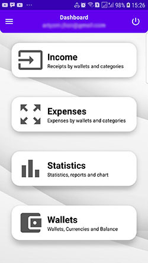
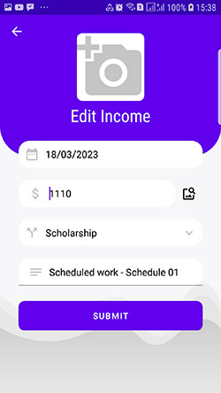
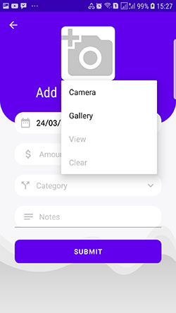
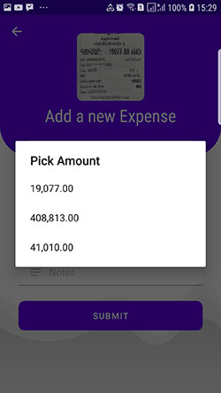
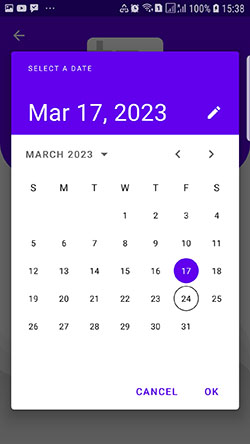
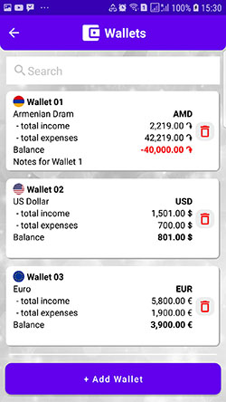

# ArFinance
App for managing personal finances

## Description
Introducing "ArFinance", the ultimate personal finance management app designed to help you keep track of your
income and expenses effortlessly. With a clean and modern user interface, ArFinance provides a user-friendly
experience that allows you to monitor your finances with ease.

ArFinance provides a simple yet comprehensive dashboard that displays your income and expenses in real-time.
You can add income sources, set budgets, and categorize your expenses to keep track of where your money is going.

ArFinance comes with a variety of customizable features, such as the ability to add notes to transactions, and
illustrate data of income and expense via user-friendly charts.

In addition to the core financial management features, ArFinance provides a personal account profile section
where you can set your image and check whether your account is verified. You can also create multiple profiles for
different family members and switch between them effortlessly.

In summary, ArFinance is the ultimate personal finance management app that provides a modern user interface,
customizable features, and a personal account profile section. With ArFinance, you can take control of your
finances and achieve your financial goals competently.

## Instruction
Don't forget to create a project in Firebase database with your user account and download **google-services.json**
file to put it in the **app** folder of the project.

## Screenshots

